# YouTube Watch Party — Backend

A real-time "watch party" backend that lets a group of users synchronize YouTube playback together. Built with **Express**, **ws** (raw WebSockets), **MongoDB**, **JWT**, and **bcrypt**. One user creates/joins a room as **Host**, others join as **Participants**, and playback controls (play/pause/seek/change video) are synced to everyone in the room in real time, gated by role-based permissions.

> Status: Backend complete and manually tested via Postman/Hoppscotch. Frontend not started yet.

---

## Tech Stack

| Layer | Technology |
|---|---|
| Server | Express (TypeScript) |
| Real-time | `ws` (WebSocket) |
| Database | MongoDB |
| Auth | JWT (JSON Web Tokens) |
| Password hashing | bcrypt |
| Manual testing | Postman & Hoppscotch |

## Project Structure

```
src/
├── handlers/
│   ├── connectionHandler.ts   # Routes incoming WS messages to the right handler
│   ├── joinRoom.ts            # join_room logic — creates or joins a room
│   ├── leaveRoom.ts           # Cleans up participant state on leave/disconnect
│   ├── playbackEvents.ts      # play / pause / seek / change_video (host+mod only)
│   └── roleManagement.ts      # assign_role and remove_participant (host only)
├── config.ts                  # Loads JWT secret from environment
├── db.ts                      # Mongoose connection + User schema/model
├── index.ts                   # Express app, HTTP + WS server bootstrap, signup/signin routes
├── middleware.ts               # Verifies JWT from the WS connection's ?token= query param
└── rooms.ts                   # In-memory room/participant state + broadcast helpers
```

Room state is kept **in memory** (`rooms.ts` — a `Map<string, Room>`), not in MongoDB. MongoDB is only used for user accounts (`db.ts`). This means room state resets if the server restarts.

### Key implementation details

**Room state (`rooms.ts`)**
```ts
export interface Room {
    roomId: string;
    hostId: string;
    currentVideoId: string;
    playState: "playing" | "paused";
    currentTime: number;
    participants: Map<string, Participant>;
}
```
Each room tracks its own playback state and participant map. `broadcastToRoom()` sends a message to every socket in a room (optionally excluding the sender), and `getParticipantsList()` strips the raw `socket` reference out before sending participant data to clients.

**Connection routing (`connectionHandler.ts`)**
Every WebSocket connection gets one `handleConnection(socket, user)` call. It keeps `currentUserId` / `currentRoomId` in closure scope for that connection, and dispatches incoming `{ event, payload }` messages to the matching handler (`joinRoom`, `leaveRoom`, `playbackEvents`, `roleManagement`). On socket `close`, it automatically calls `handleLeaveRoom` so disconnects clean up participant state.

**Join logic (`joinRoom.ts`)**
```ts
let room = roomId ? rooms.get(roomId) : undefined;
let isNewRoom = false;

if (!room) {
    const newRoomId = roomId || generateRoomId();
    room = { roomId: newRoomId, hostId: userId, ... };
    rooms.set(newRoomId, room);
    isNewRoom = true;
}

const role = isNewRoom ? "host" : "participant";
```
If no `roomId` is passed, or the passed `roomId` doesn't exist yet, a brand-new room is created and the joiner becomes **Host**. If the room already exists, the joiner is added as a plain **Participant** — role upgrades happen separately via `assign_role`.

**Permission checks (`playbackEvents.ts`, `roleManagement.ts`)**
Every restricted action re-fetches the requester's live `Participant` object from the room and checks its `role` before doing anything:
```ts
if (participant.role !== "host" && participant.role !== "moderator") {
    socket.send(JSON.stringify({
        event: "error",
        payload: { message: "You don't have permission to control playback" }
    }));
    return;
}
```
`assign_role` and `remove_participant` use the same pattern but require `role === "host"` specifically.

---

## Authentication Flow

### 1. Sign Up — `POST /signup`

Creates a new user with a bcrypt-hashed password.

**Request**
```json
{
  "username": "rumman",
  "password": "test1234"
}
```

**Success — `200 OK`**
```json
{ "message": "You have Signup" }
```
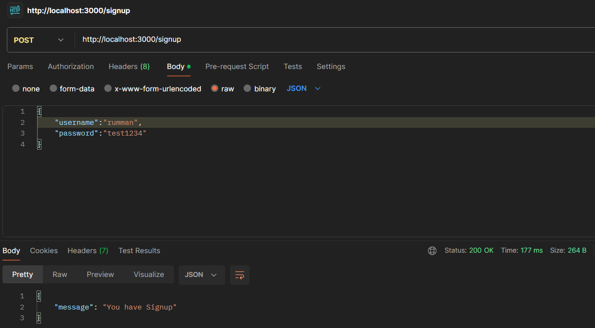

**Duplicate user — rejected**
```json
{ "message": "user already exist" }
```
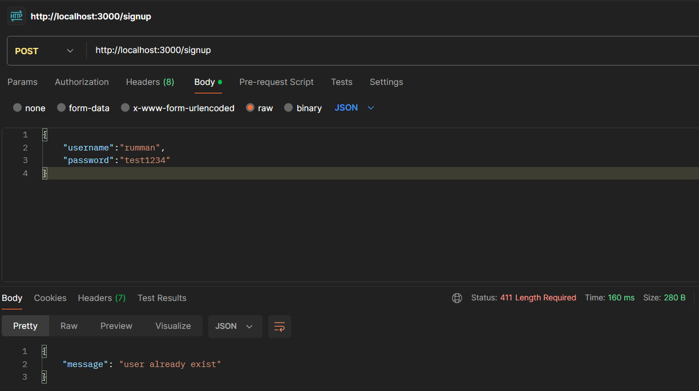

> Note: the duplicate-user response currently returns `411 Length Required`. This is almost certainly unintentional — worth changing to `409 Conflict` before the frontend is wired up, so error handling on the client can branch on status code cleanly.

---

### 2. Sign In — `POST /signin`

Validates credentials and issues a JWT.

**Request**
```json
{
  "username": "rumman",
  "password": "test1234"
}
```

**Success — `200 OK`**
```json
{ "token": "eyJhbGciOiJIUzI1NiIsInR5cCI6IkpXVCJ9..." }
```
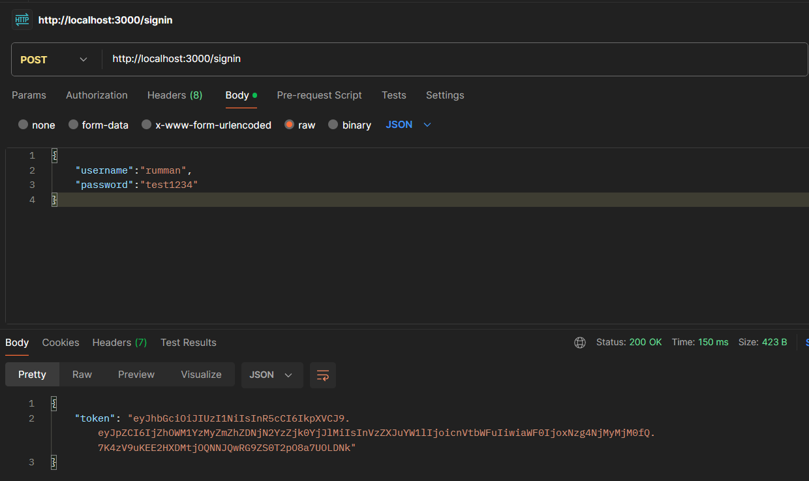

**Invalid credentials — `403 Forbidden`**
```json
{ "message": "Invalid credentials" }
```
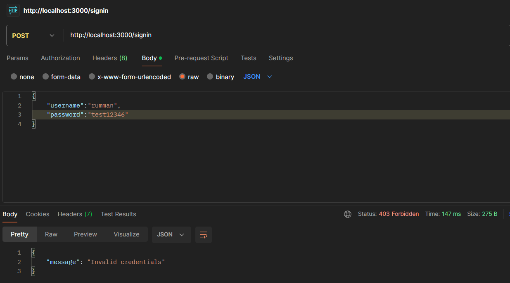

---

## WebSocket Protocol

All real-time features run over a single WebSocket connection. The JWT issued at sign-in is passed as a query parameter on the WS URL:

```
ws://localhost:3000?token=<JWT>
```

`middleware.ts` verifies this token **before** upgrading/accepting the connection — no valid token, no connection.

**Connecting without a token → rejected**
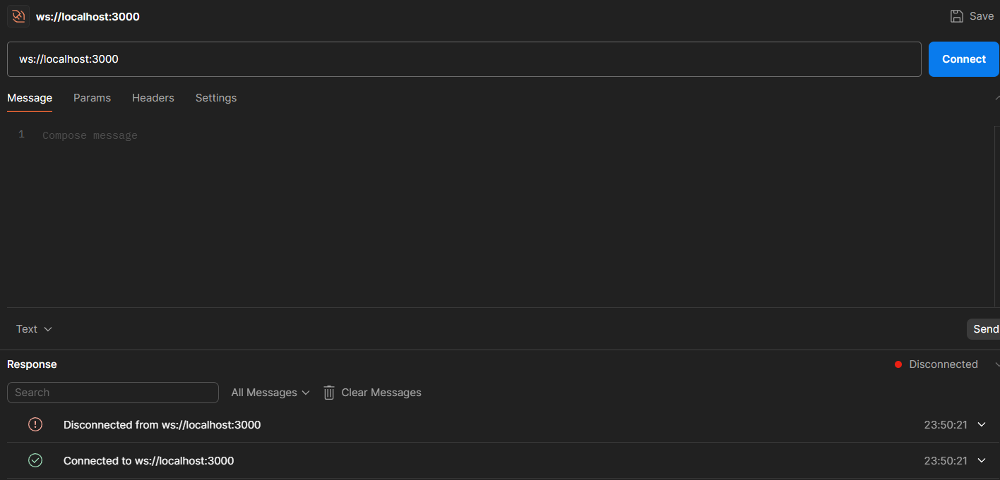

**Connecting with a valid token → accepted**
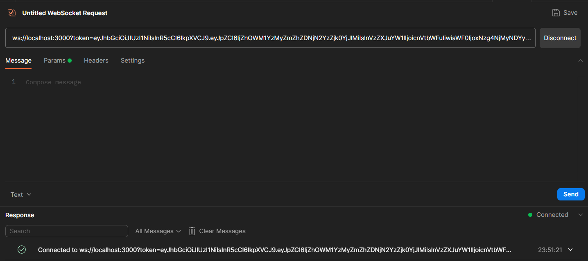

### Message envelope

Every message, both client → server and server → client, follows the same shape:

```json
{
  "event": "event_name",
  "payload": { ... }
}
```

---

### `join_room`

The first user to join with no `roomId` in the payload gets a new auto-generated room code and becomes **Host**. Any user who joins with an existing `roomId` becomes a **Participant**.

**Host creates a room**

Request:
```json
{ "event": "join_room", "payload": {} }
```

Response (`room_joined`):
```json
{
  "event": "room_joined",
  "payload": {
    "roomId": "nlyuvc",
    "userId": "2j5ha0aj",
    "role": "host",
    "participants": [
      { "userId": "2j5ha0aj", "username": "rumman", "role": "host" }
    ]
  }
}
```
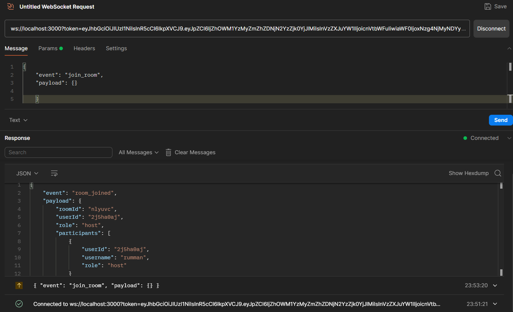

**A second user signs up and signs in** (to demonstrate a real multi-user scenario):
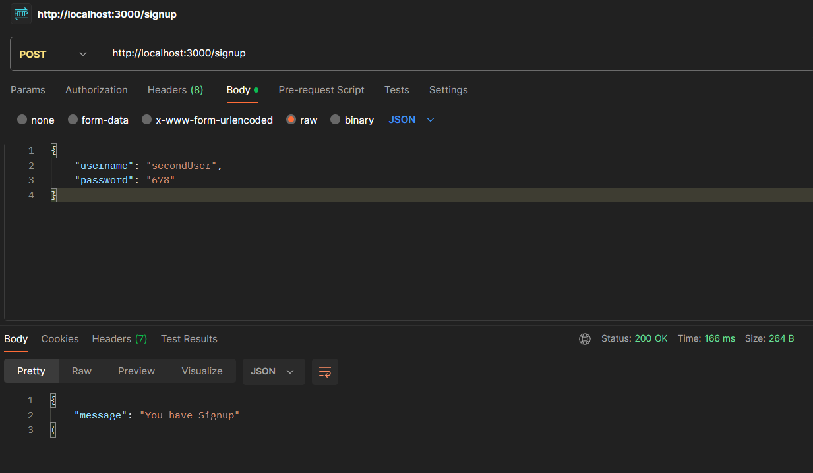
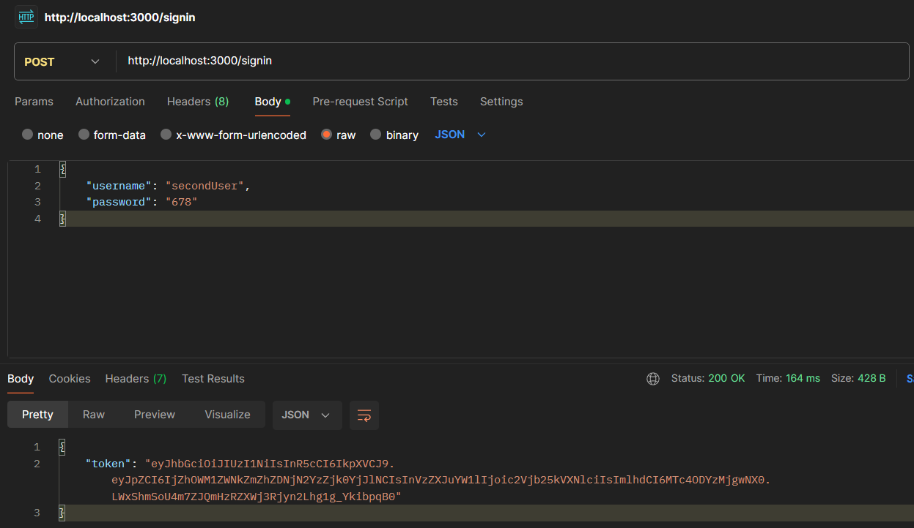

**Second user joins the same room as Participant**

Request:
```json
{ "event": "join_room", "payload": { "roomId": "nlyuvc" } }
```

The joining user receives `room_joined` with `"role": "participant"` and the full participant list; the **existing** room members (the host) receive a broadcast `user_joined` event so their UI can update without re-fetching.

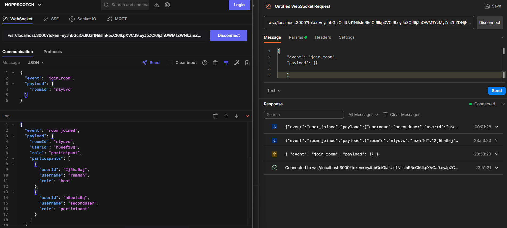

---

### Playback controls — `play`, `pause`, `seek`, `change_video`

These are restricted to users with role `host` or `moderator`. Any allowed action broadcasts a `sync_state` event to **every** client in the room so everyone's player stays in sync.

**Rejected — a plain Participant tries to `play`**
```json
{ "event": "error", "payload": { "message": "You don't have permission to control playback" } }
```
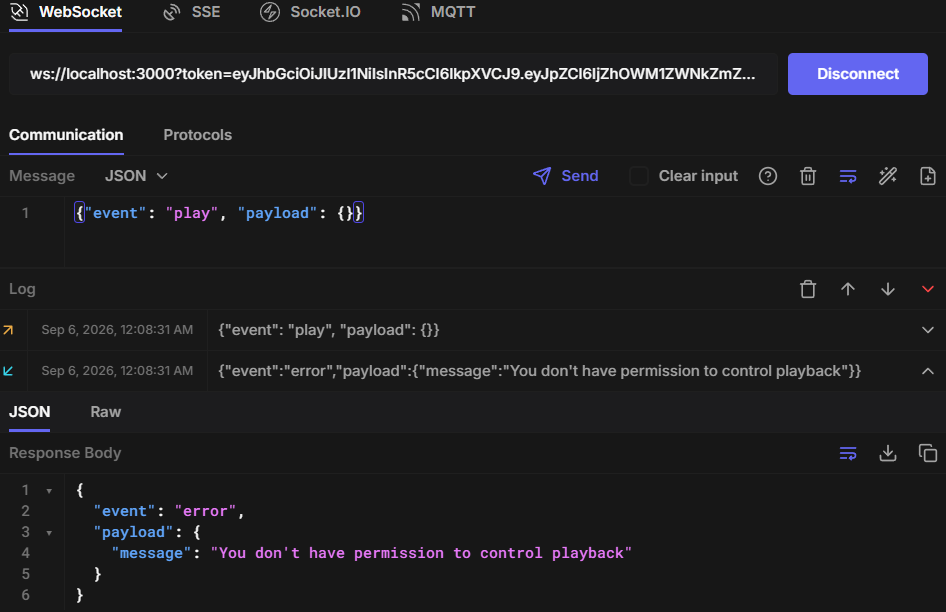

**Accepted — the Host sends `play`**

Request:
```json
{ "event": "play", "payload": {} }
```

Broadcast to room:
```json
{
  "event": "sync_state",
  "payload": { "playState": "playing", "currentTime": 0, "videoId": "" }
}
```
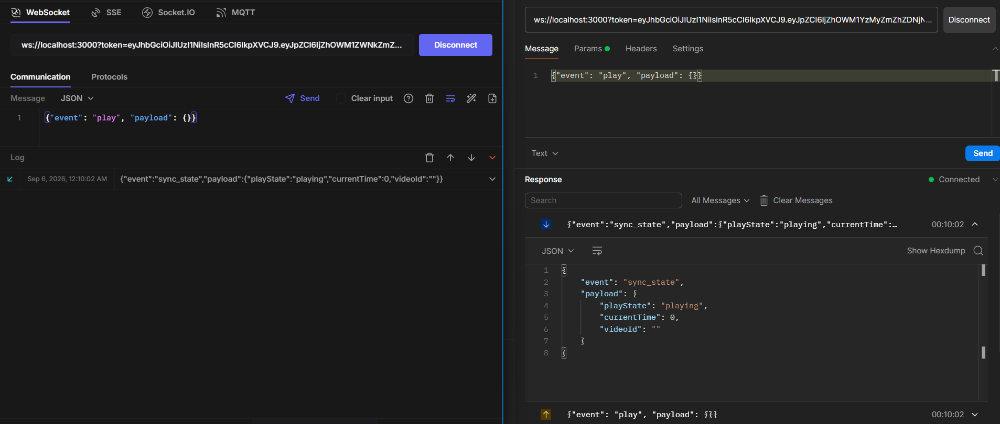

---

### `assign_role` (Host-only)

Lets the Host promote/demote another participant's role (e.g. to `moderator`). Broadcasts the updated participant list to the whole room via `role_assigned`.

Request:
```json
{
  "event": "assign_role",
  "payload": { "userId": "h5eefi0q", "role": "moderator" }
}
```

Broadcast:
```json
{
  "event": "role_assigned",
  "payload": {
    "userId": "h5eefi0q",
    "username": "secondUser",
    "role": "moderator",
    "participants": [
      { "userId": "2j5ha0aj", "username": "rumman", "role": "host" },
      { "userId": "h5eefi0q", "username": "secondUser", "role": "moderator" }
    ]
  }
}
```
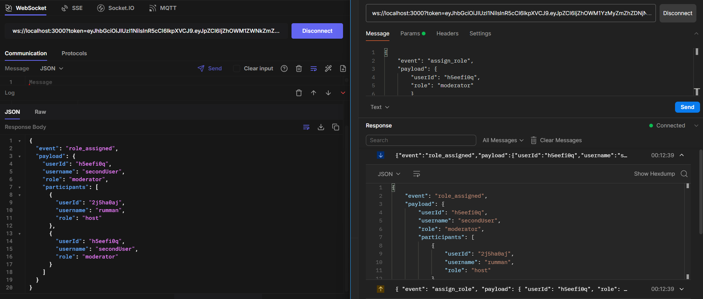

**Now that they're a Moderator, `pause` succeeds for them too:**

Request:
```json
{ "event": "pause", "payload": {} }
```

Broadcast:
```json
{
  "event": "sync_state",
  "payload": { "playState": "paused", "currentTime": 0, "videoId": "" }
}
```
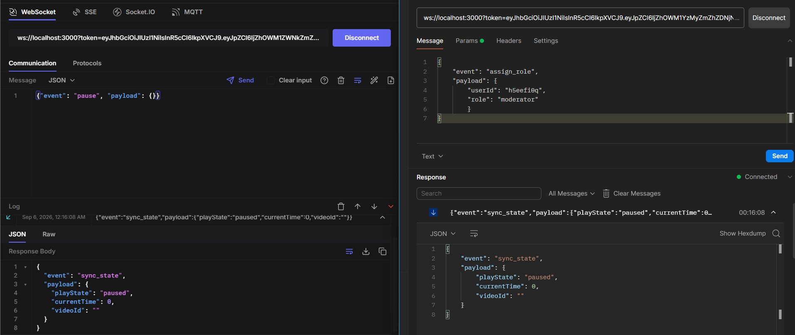

---

### `remove_participant` (Host-only)

Removes a user from the room entirely. Broadcasts `participant_removed` (with the updated participant list) to the remaining room members, and sends `removed_from_room` directly to the user who got kicked.

**Host removes the second user**

Request:
```json
{ "event": "remove_participant", "payload": { "userId": "h5eefi0q" } }
```

The removed user receives:
```json
{ "event": "removed_from_room", "payload": { "message": "You were removed from the room" } }
```

The remaining room members receive:
```json
{
  "event": "participant_removed",
  "payload": {
    "userId": "h5eefi0q",
    "participants": [
      { "userId": "2j5ha0aj", "username": "rumman", "role": "host" }
    ]
  }
}
```
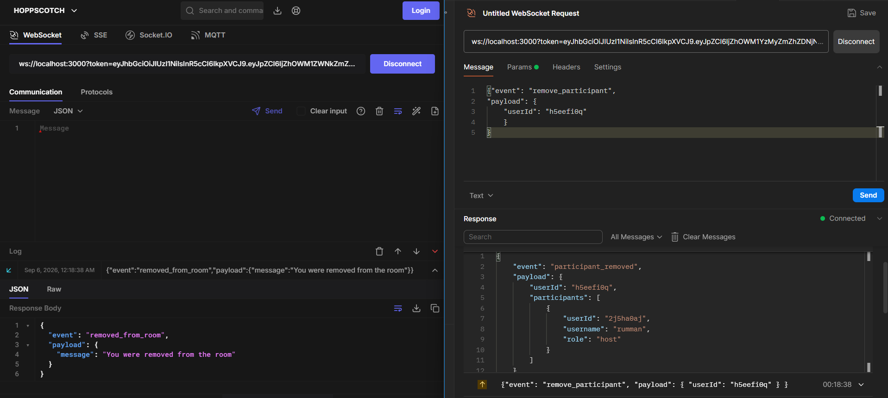

**Rejected — a non-Host tries to remove a participant**
```json
{ "event": "error", "payload": { "message": "Only the host can remove participants" } }
```
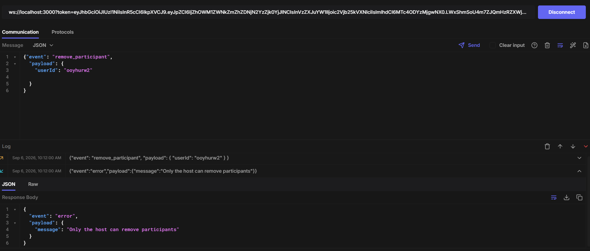

---

## Event Reference

| Event (client → server) | Who can send it | Broadcasts |
|---|---|---|
| `join_room` | Anyone with a valid token | `room_joined` (to sender), `user_joined` (to existing room members) |
| `play` / `pause` / `seek` / `change_video` | Host, Moderator | `sync_state` (to whole room) |
| `assign_role` | Host only | `role_assigned` (to whole room) |
| `remove_participant` | Host only | `participant_removed` (to room), `removed_from_room` (to removed user) |

| Event (server → client) | Meaning |
|---|---|
| `room_joined` | Sent to a user right after they successfully join/create a room |
| `user_joined` | A new participant joined the room you're in |
| `sync_state` | Playback state changed — update your player |
| `role_assigned` | A participant's role changed |
| `participant_removed` | Someone was removed from the room |
| `removed_from_room` | You specifically were removed |
| `error` | An action was rejected (e.g. permission denied) |

---

## Test Coverage Summary

| # | Scenario | Result |
|---|---|---|
| 1 | Signup — new user | ✅ 200 OK |
| 2 | Signup — duplicate username | ✅ Rejected |
| 3 | Signin — correct credentials | ✅ 200 OK, JWT returned |
| 4 | Signin — wrong password | ✅ 403 Forbidden |
| 5 | WebSocket connect — no token | ✅ Rejected |
| 6 | WebSocket connect — valid token | ✅ Accepted |
| 7 | `join_room` — first user (becomes Host) | ✅ Room created |
| 8 | Signup — second user | ✅ 200 OK |
| 9 | Signin — second user | ✅ 200 OK, JWT returned |
| 10 | `join_room` — second user (becomes Participant) | ✅ Joined + host notified |
| 11 | `play` as Participant | ✅ Correctly rejected |
| 12 | `play` as Host | ✅ Broadcast to room |
| 13 | `assign_role` — Host promotes Participant to Moderator | ✅ Broadcast to room |
| 14 | `pause` as (newly-promoted) Moderator | ✅ Broadcast to room |
| 15 | `remove_participant` as Host | ✅ Both parties notified |
| 16 | `remove_participant` as non-Host | ✅ Correctly rejected |

All 16 cases tested manually via Postman (HTTP) and Hoppscotch (WebSocket) and confirmed working as expected.
